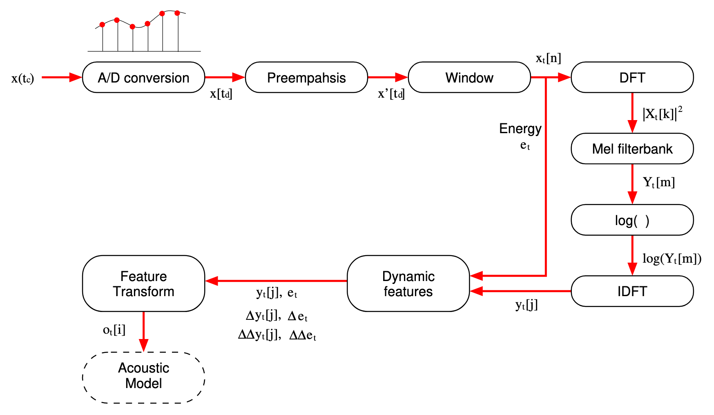
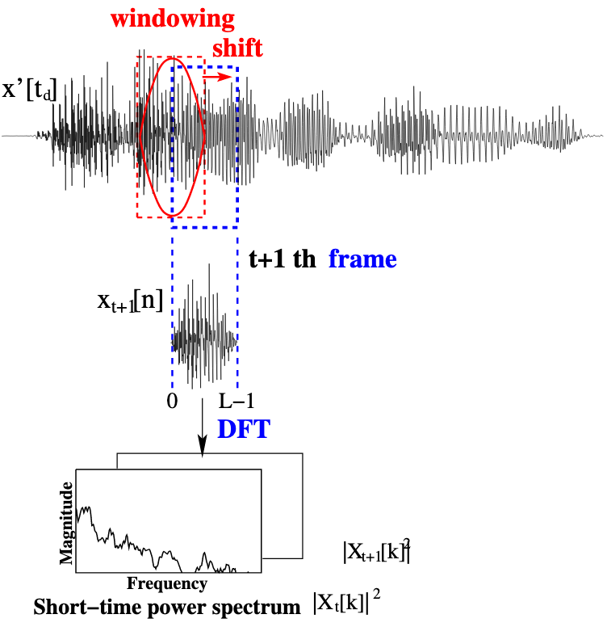
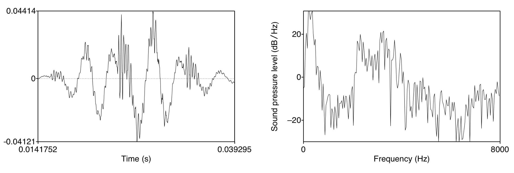
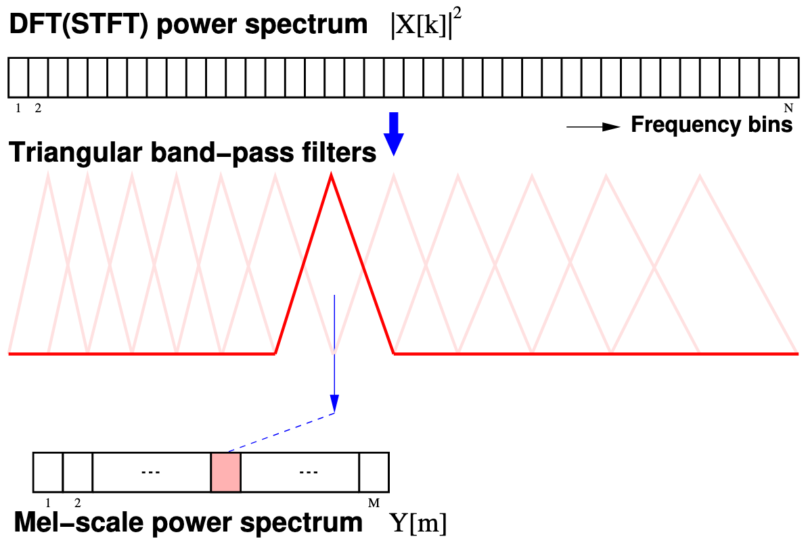

$$
% Display
\newcommand{\ds}{\displaystyle}
\newcommand{\ob}{\overbrace}
\newcommand{\ub}{\underbrace}
\newcommand{\code}{\texttt}

% Colours
\newcommand{\red}[1]{\textcolor{red}{#1}}
\newcommand{\redt}[1]{\textcolor{red}{\text{#1}}}
\newcommand{\blue}[1]{\textcolor{blue}{#1}}
\newcommand{\bluet}[1]{\textcolor{blue}{\text{#1}}}
\newcommand{\green}[1]{\textcolor{green}{#1}}
\newcommand{\greent}[1]{\textcolor{green}{\text{#1}}}

% Typefaces/Text-styles
\newcommand{\mc}{\mathcal}
\newcommand{\mf}{\mathfrak}
\renewcommand{\b}{\mathbf}
\newcommand{\bs}{\boldsymbol}

% Fractions
\newcommand{\f}{\frac}

% Positioning
\renewcommand{\l}{\left}
\newcommand{\m}{\middle}
\renewcommand{\r}{\right}

% Logic
\newcommand{\n}{\not}
\newcommand{\eq}{\equiv}
\newcommand{\xor}{\oplus}

% Sets
\newcommand{\fa}{\forall}
\newcommand{\te}{\exists}
\newcommand{\set}[1]{\l\lbrace#1\r\rbrace}
\newcommand{\setb}[2]{\l\lbrace#1\ \m| \ #2\r\rbrace}
\newcommand{\bb}{\mathbb}
\newcommand{\R}{\bb{R}}
\newcommand{\N}{\bb{N}}
\newcommand{\Z}{\bb{Z}}
\newcommand{\Q}{\bb{Q}}
\newcommand{\C}{\bb{C}}

% Derivatives
\renewcommand{\d}[1]{\mathrm{d}#1}
\newcommand{\deriv}[2]{\f{\d{#1}}{\d{#2}}}
\newcommand{\pderiv}[2]{\f{\partial #1}{\partial #2}}

% Sums/Integrals
\newcommand{\s}[3]{\sum_{#1}^{#2}#3}
\renewcommand{\i}[4]{\int_{#1}^{#2}#3\ \d{#4}}

% Probability
\newcommand{\p}[1]{\bb{P}\l(#1\r)}
\newcommand{\cp}[2]{\p{#1\ \m|\ #2}}
\newcommand{\jp}[2]{\p{#1,#2}}
\newcommand{\e}[2][{}]{\bb{E}_{#1}\l[#2\r]}
\newcommand{\var}[1]{\text{Var}\l[#1\r]}
\newcommand{\sd}[1]{\text{SD}\l[#1\r]}
\newcommand{\cov}[2]{\text{Cov}\l[#1,#2\r]}
% Probability distributions
\newcommand{\pd}[1]{p\l(#1\r)}
\newcommand{\cpd}[2]{p\l(#1\ \m|\ #2\r)}
\newcommand{\jpd}[2]{p\l(#1,#2\r)}

% Binomials
\newcommand{\ch}{\binom}
\newcommand{\pbin}[3][{}]{\l(#2 + #3\r)^#1}
\newcommand{\mbin}[3][{}]{\l(#2 - #3\r)^#1}

% Linear Algebra
\newcommand{\T}{\mathsf{T}}
\newcommand{\seq}[4][{}]{#2_{#3}#1 \ldots #1 #2_{#4}}
\newcommand{\rowv}[3]{\l(\seq[,]{#1}{#2}{#3}\r)}
\newcommand{\colv}[3]{\rowv{#1}{#2}{#3}^\T}
\newcommand{\sqpmat}[3][{}]{
    \begin{pmatrix}
		#2_{1{#1}1} & #2_{1{#1}2} & \cdots & #2_{1{#1}j} & \cdots & #2_{1{#1}#3} \\
		#2_{2{#1}1} & #2_{2{#1}2} & \cdots & #2_{2{#1}j} & \cdots & #2_{2{#1}#3} \\
		\vdots & \vdots & \ddots & \vdots & \ddots & \vdots \\
		#2_{i{#1}1} & #2_{i{#1}2} & \cdots & #2_{i{#1}j} & \cdots & #2_{i{#1}#3} \\
		\vdots & \vdots & \ddots & \vdots & \ddots & \vdots \\
		#2_{#3{#1}1} & #2_{#3{#1}2} & \cdots & #2_{#3{#1}j} & \cdots & #2_{#3{#1}#3} \\
	\end{pmatrix}
}

% argmax and argmin
\newcommand{\argmax}{\mathop{\arg\max}}
\newcommand{\argmin}{\mathop{\arg\min}}
$$

[toc]

# Automatic Speech Recognition

## Introduction to ASR

### Types of speech-to-text transcription tasks

- **Speaker diarization**: Who spoke when?
- **Speech recognition**: What did they say?
- **Paralinguistic aspects**: How did they say it (timing, intonation, voice quality)
- **Speech understanding**: What does it mean? (NLU)

### Challenges of ASR

#### Linguistic perspective

There are many sources of variation in speech:

- **Speaker**: Is the system tuned for a specific speaker, or speaker-independent?
- **Environment**: Noise, competing speakers, channel conditions (microphone, phone line, room acoustics)
- **Style**: Continuous or isolated speech recognition? Planned monologue or spontaneous conversation?
- **Vocabulary**: Machine-directed commands, scientific language or colloquial expressions?
- **Accent/Dialect**: The system should be able to recognize the speech of all speakers of a particular language.
- **Spoken language**: There are an estimated 7,000 languages, most with limited training resources.

#### Machine learning perspective

- As a classification problem, it has a very high-dimensional output space.
- As a sequence-to-sequence problem, there are very long input sequences.
- Data is often noisy.
- Very limited quantities of training data available (compared to text-based NLP).

### The speech recognition problem

- We denote a sequence of ==**acoustic feature vectors**== (or ==**observations**==) as:
  $$
  X=\seq[,]{\b{x}}{1}{T}
  $$
  These observations are a representation of recorded speech.

- The output ==**word sequence**== is denoted as $W$.

In speech recognition, our aim is to find the most likely $W$ given $X$.

To achieve this, statistical models are trained using a ==**corpus**== of labelled training utterances $\mc{D}_\text{train}=\set{(X^{(n)},W^{(n)})}_{n=1}^N$.

### Representing recorded speech ($X$)

Each acoustic feature vector or observation $\b{x}^{(t)}$ is a vector of parameters, such as MFCCs.

### Representing labeled speech ($W$)

- Speech labels may be at different levels: _words_, _phones_, etc.
- Speech labels may be time-aligned — i.e. the start and end times of an acoustic segment corresponding to a label are known.

### Two key challenges

- In **training** the model: 

  Aligning the sequences $X^{(n)}$ and $W^{(n)}$ for each training utterance.

- In **performing recognition**:

  Searching over all possible output sequences $W$ to find the most likely one.

The ==**Hidden Markov Model**== (HMM) provides a good solution to both problems.

### The Hidden Markov Model

- Maps a sequence of continuous observations to a sequence of discrete outputs.
- Is a **generative** model for the observation sequence.

### Fundamental equation of statistical speech recognition

Recall the speech recognition problem defined [earlier](#the-speech-recognition-problem).

If $X$ is the sequence of acoustic feature vectors or observations, and $W$ denotes a word sequence, then the most likely word sequence $W^*$ is given by:
$$
W^*=\argmax_{W} \cp{W}{X}
$$
Applying Bayes' theorem:
$$
\begin{align}
	\cp{W}{X} &= \f{\cpd{X}{W}\p{W}}{\pd{X}}\\
						&\propto \cpd{X}{W}\p{W}\\\\
				W^* &=\argmax_W 
							\ub{\cpd{X}{W}}_\stackrel{\redt{Acoustic model}}{}
							\ub{\p{W}}_\stackrel{\redt{Language model}}{}
\end{align}
$$

### Speech recognition components

We can use an **acoustic model**, **language model**, and **lexicon** to obtain the most probable word sequence $W^*$ given the observed acoustics $X$.

### Phones and phonemes

- ==**Phonemes**== are an abstract unit defined by linguists, based on contrastive role in word meanings. There are 40-50 phonemes in English.

  > **Example**: /c/ and /b/ in `cat`and `bat`

  If a phoneme is swapped with another, the meaning of the word changes.

  Phonemes are **not** speech sounds — they are an idea.

- ==**Phones**== are speech sounds defined by the acoustics. There are many allophones of the same phoneme, and there is a limitless number of phonemes.

  > **Example**: /t/ in `hit`, `tip` and `little`

- Many phones can all map to one phoneme — these are called **allophones** of the same phoneme.

  > **Example**: Vowel allophones are common. For example, /ou/ in the `house` can be pronounced as /oo/ (Scotland), /au/ (Southern British), /ah/ (South London), /ui/ (Northern Ireland) etc.

Phones are usually used in ASR, but there is no conclusive evidence that they are the basic units in speech recognition. Possible alternatives are syllables and automatically derived units.

### Basic speech recognition on TIMIT

The ==**TIMIT corpus**== was the first widely used speech corpus, still in use.

- Contains utterances from 630 North American speakers
- All utterances are phonetically transcribed and time-aligned
- The agreed evaluation metric is **phone error rate**

The TIMIT corpus is usually used for the task of **phone recognition** — labeling the audio of a recorded utterance with a sequence of phone symbols. But it is also used for other tasks:

- _Frame classification_: attach a phone label to each frame data
- _Phone classification_: given a segmentation of the audio, attach a phone label to each (multi-frame) segment
- _Phone recognition_: supply the sequence of labels corresponding to the recorded utterance

### Evaluation

To quantify the accuracy of a speech recognizer, we use **string edit distance**:

- Use dynamic programming to align the ASR output with a reference transcription, with three types of error: **insertion**, **deletion** and **substitution**.

The ==**Word Error Rate (WER)**== sums the three types of error. If there are $N$ words in the reference script, and the ASR output has $S$ substitutions, $D$ deletions and $I$ insertions, then:
$$
\text{WER} = 100\cdot\f{S+D+I}{N}\%\qquad
\text{Accuracy} = 100-\text{WER}\%
$$
For TIMIT, we define phone error rate analogously to WER.

## Hidden Markov Models and Gaussian Mixture Models

### The Hidden Markov Model

- The ==**Hidden Markov Model (HMM)**== is a statistical model for time series data with a set of **discrete** states $\set{1,\ldots,J}$ (we index them by $j$ or $k$).
- At each time step $t$:
  - the model is in a fixed state $q_t$,
  - the model generates an observation, $\b{x}_t$, according to an **emission probability distribution** that is specific to the state.
- We do not actually observe which state the model is in at each time step — hence **hidden**.
- Observations may be either continuous or discrete, but are usually discrete.

#### Assumptions

- If we know the state at time step $t$, $q_t=k$, then the probability of being in a new state, $j$ at the next time step, is dependent only on $q_t$. This is the **Markov assumption**.
- **Observation independence** is the assumption that an observation $\b{x}_t$ depends only on the state that generated it, $q_t$.

With these assumptions, a HMM can be parameterized with the parameters $\lambda$:

- **Transition probabilities**: $a_{kj}=\cp{q_{t+1}=j}{q_t=k}$
- **Observation probabilities**: $b_j(\b{x}_t)=\cp{\b{x}_t}{q_t=j}$

#### Topologies

The ==**topology**== of a HMM determines the set of permitted transitions between states.

Any topology is possible, but we typically use the following in ASR:

- **Ergodic**: Each state has a non-zero probability of transitioning to every other states — that is, $a_{kj}>0\quad\fa k,j$.
- **Left-to-right**: Each state $k$ may only transition to itself and state $k+1$ — that is, $a_{kj}=0\quad\text{if $j\n\in\set{k,k+1}$}$.
- **Parallel path left-to-right**: Each state $k$ is only permitted to transition to state $j$ if $j \geq k$, meaning $a_{kj}=0$ if $j < k$. This restriction imposes an upper triangular transition matrix.

With left-to-right generally being the most popular topology.

#### HMMs for ASR

- In ASR, words or phones are represented by a left-to-right HMM (LR-HMM).
- Traditionally, HMMs for ASR model each phone with three distinct states (which also enforces a minimum phone duration of three observation frames).
- The phone HMMs can be concatenated to form a HMM to represent an entire word.

This model naturally generates an alignment between states and observations, and hence words/phones.

#### Observation probabilities

<table>
  <thead>
    <tr>
      <th>HMM type</th>
      <th colspan=2>Observation probability</th>
    </tr>
  </thead>
  <tbody>
    <tr>
      <td>Discrete (probability) HMM</td>
      <td>Discrete</td>
      <td>Vector quantization</td>
    </tr>
    <tr>
      <td>Continuous (density) HMM</td>
      <td>Continuous</td>
      <td>GMM, DNN</td>
    </tr>
    <tr>
      <td>Semi-continuous (tied-mixture) HMM</td>
      <td>Continuous</td>
      <td>Tied mixture</td>
    </tr>
  </tbody>
</table>

#### Computing likelihoods with HMMs

Suppose we have an observation sequence of length $T$, $X=\seq[,]{\b{x}}{1}{T}$, and $Q$ is a known state sequence $\seq[,]{q}{1}{T}$.

Then we can use the HMM to compute the joint likelihood of $X$ and $Q$:
$$
\begin{align}
	\jp{X}{Q\ ;\lambda} 
	&= \cp{X}{Q}\p{Q} \\
	&= \cp{\seq[,]{\b{x}}{1}{T}}{\seq[,]{q}{1}{T}}\p{\seq[,]{q}{1}{T}} \\
	&\quad\ \text{By observation independence and Markov assumption:} \\
	&= \l[\cp{\b{x}_1}{q_1}\prod_{t=2}^T\cp{\b{x}_t}{q_t}\r]
	   \l[\p{q_1}\prod_{t=2}^T\cp{q_t}{q_{t-1}}\r] \\
	&= \cp{\b{x}_1}{q_1}\p{q_1}\prod_{t=2}^T\cp{\b{x}_t}{q_t}\cp{q_t}{q_{t-1}}
\end{align}
$$
—where $\p{q_1}$ denotes the initial occupancy probability of each state.

- $\cp{\b{x}_t}{q_t}$ is an **emission probability distribution**. The most simple example is the multivariate Gaussian:
  $$
  \begin{align}
    b_j(\b{x}_t)
    &\stackrel{\text{def}}{=} \cp{\b{x}_t}{q_t=j} \\
    &= \mc{N}\l(\b{x}_t\ ;\bs\mu_j,\bs\Sigma_j\r) \\
    &= \f{1}{\sqrt{(2\pi)^D|\bs\Sigma_j|}} \exp\l[-\f{1}{2}\big(\b{x}_t-\bs\mu_j\big)^\T\bs\Sigma_j\big(\b{x}_t-\bs\mu_j\big)\r]
    
  \end{align}
  $$
  This emission distribution is specific to state $j$, and is parameterized by a mean vector $\bs\mu_j$ and covariance matrix $\bs\Sigma_j$.

- $\cp{q_t}{q_{t-1}}$ is a **transition probability**.

#### Mixture model

A more flexible form of density estimation is made up of a linear combination of component densities:
$$
\pd{\b{x}} = \s{m=1}{M}{\p{m}\cpd{\b{x}}{m}}
$$

- This is called a ==**mixture model**== or a **mixture density**. Where:
  - $\cpd{\b{x}}{m}$ is a **component density**,
  - $\p{m}$ is a **mixing parameter**, which specifies how much a component density contributes to the mixture density.
- A mixture model is generative:
  1. choose a mixture component based on $\p{m}$,
  2. generate a data point $\b{x}$ from the chosen component using $\cpd{\b{x}}{m}$.

##### Gaussian Mixture Model

- The most important mixture model is the ==**Gaussian Mixture Model (GMM)**==, where the component densities are Gaussians.

- Consider a GMM, where each component Gaussian $\mc{N}\l(\b{x}\ ;\bs\mu_m,\bs\Sigma_m\r)$ has mean $\bs\mu_m$ and a spherical covariance $\bs\Sigma_m=\sigma_m^2\bb{I}$, then this GMM is defined by:
  $$
  \begin{align}
  	\pd{\b{x}} 
  	&= \s{m=1}{M}{\p{m}\cpd{\b{x}}{m}} \\
  	&= \s{m=1}{M}{\p{m}\mc{N}\l(\b{x}\ ;\bs\mu_m,\sigma^2_m\bb{I}\r)}
  \end{align}
  $$

###### GMM parameter estimation

- Define the indicator variable $z_{mt}=1$ if component $m$ generated observation $\b{x}_t$, and 0 otherwise.

- If $z_{mt}$ wasn't hidden, then we could count the number of observations generated by $m$:
  $$
  N_m=\s{t=1}{T}{z_{mt}}
  $$
  and then we can use this to estimate the mean, variance and mixing parameters:
  $$
  \begin{align}
  	\hat{\bs\mu}_m &= \f{\s{t=1}{T}{z_{mt}\b{x}_t}}{N_m} \\
  	\hat{\sigma}_m^2 &= \f{\s{t=1}{T}{z_{mt}||\b{x}_t-\hat{\bs\mu}_m||^2}}{N_m} \\
  	\hat{\bb{P}}\ (m) &= \f{1}{T}\s{t=1}{T}{z_{mt}} = \f{N_m}{T}
  \end{align}
  $$

- **Problem**: But we don't know $z_{mt}$ — which mixture component $\b{x}_t$ comes from.

- **Solution**: Use the posterior probability $\cp{m}{\b{x}}$, which gives the probability that component $m$ was responsible for generating $\b{x}$:
  $$
  \begin{align}
  	\cp{m}{\b{x}} &= \f{\cpd{\b{x}}{m}\p{m}}{\pd{\b{x}}} \\
  	&= \f{\cpd{\b{x}}{m}\p{m}}{\s{m'=1}{M}{\cpd{\b{x}}{m'}\p{m'}}}
  \end{align}
  $$
  —where $\cp{m}{\b{x}}$ is called a ==**component occupation probability**==, or **responsibility**.

  Since they are posterior probabilities, we must have $\s{m=1}{M}{\cp{m}{\b{x}}}=1$.

###### Soft assignment

- We can estimate ==**soft counts**== based on the component occupation probabilities $\cp{m}{\b{x}_t}$:
  $$
  N_m^*=\s{t=1}{T}{\cp{m}{\b{x}_t}}
  $$

- We can imagine assigning data points to component $m$, weighted by the component occupation probability $\cp{m}{\b{x}_t}$, which allows us to imagine estimating the mean, variance and prior probabilities as:
  $$
  \begin{align}
    \hat{\bs\mu}_m &= \f{\s{t=1}{T}{\cp{m}{\b{x}_t}\b{x}_t}}{\s{t=1}{T}{\cp{m}{\b{x}_t}}} = \f{\s{t=1}{T}{\cp{m}{\b{x}_t}\b{x}_t}}{N_m^*} \\
      \hat{\sigma}_m^2 &= \f{\s{t=1}{T}{\cp{m}{\b{x}_t}||\b{x}_t-\hat{\bs\mu}_m||^2}}{\s{t=1}{T}{\cp{m}{\b{x}_t}}} = \f{\s{t=1}{T}{\cp{m}{\b{x}_t}||\b{x}_t-\hat{\bs\mu}_m||^2}}{N_m^*} \\
      \hat{\bb{P}}\ (m) &= \f{1}{T}\s{t=1}{T}{\cp{m}{\b{x}_t}} = \f{N_m^*}{T}
  \end{align}
  $$

- **Problem**: Recall that:
  $$
  \begin{align}
  	\cp{m}{\b{x}} &= \f{\cpd{\b{x}}{m}\p{m}}{\pd{\b{x}}} \\
  	&= \f{\cpd{\b{x}}{m}\p{m}}{\s{m'=1}{M}{\cpd{\b{x}}{m'}\p{m'}}}
  \end{align}
  $$
  We need to know $\cpd{\b{x}}{m}$ and $\p{m}$ to estimate the parameters of $\cp{m}{\b{x}}$, and to estimate $\p{m}$ we need to know $\cpd{\b{x}}{m}$ and $\p{m}$… Circularity!

- **Solution**: an iterative algorithm where each iteration has two pars:

  1. **E (Expectation)**: Compute the component occupation probabilities $\cp{m}{\b{x}}$ using the current estimates of the GMM parameters (means, variances, mixing parameters).
  2. **M (Maximization)**: Compute the GMM parameters using the current estimates of the component occupation probabilities.

  Starting from some initialization (e.g. using $k$-means for the means), these steps are alternated until convergence.

  This algorithm is called the **EM** algorithm and can be shown to maximize the likelihood — guaranteed to converge to a local maximum.

###### Maximum likelihood parameter estimation

- The likelihood of a dataset $X=\set{\seq[,]{\b{x}}{1}{T}}$ is given by $\mc{L}=\prod_{t=1}^T\pd{\b{x}_t}$, or for a GMM:
  $$
  \mc{L}=\prod_{t=1}^T\s{m=1}{M}{\cpd{\b{x}_t}{m}\p{m}}
  $$

- We can regard the negative log-likelihood as an error function.

###### Summary on GMMs

- GMMs trained using the EM algorithm are able to self-organize to fit a dataset.
- Individual components take responsibility for parts of the dataset.
- Observations are soft-assigned to components, not hard-assigned. GMMs are therefore said to perform **soft clustering**.

#### HMM algorithms

Working with HMMs requires the solution of three problems:

1. **Likelihood/Evaluation**: Determine the overall likelihood of an observation sequence $X=\seq[,]{\b{x}}{1}{T}$ being generated by a known HMM topology $\mc{M}$.

   This problem is solved by the **forward algorithm**.

2. **Decoding/Alignment**: Given an observation sequence and a HMM, determine the most probable hidden state sequence.

   This problem is solved by the **Viterbi algorithm**.

3. **Training**: Given an observation sequence and a HMM, learn the state occupation probabilities, in order to find the best HMM parameters $\lambda^*$.

   This problem is solved by the **forward-backward** and **Baum-Welch** algorithms.

**Note**: By the HMM topology $\mc{M}$, we can mean:

- A restricted left-to-right topology based on a known word/sentence, leading to a trellis-like structure over time.
- A much less restricted topology based on a grammar or language model — or something in between.
- The forward/backward algorithms are not generally suitable for unrestricted topologies.

##### Likelihood

- **Goal**: Determine $\cpd{X}{\mc{M}}$

- **Approach**: Sum over all possible state sequences $Q=\seq[,]{q}{1}{T}$ that could result in the observation sequence $X$:
  $$
  \begin{align}
  	\cpd{X}{\mc{M}} 
  	&= \s{Q\in\mc{Q}}{}{\cp{X, Q}{\mc{M}}} \\
  	&= \cp{\b{x}_1}{q_1}\p{q_1}\prod_{t=2}^T\cp{\b{x}_t}{q_t}\cp{q_t}{q_{t-1}}
  \end{align}
  $$

- But we need to calculate $\ob{N\times N\times\cdots\times N}^\text{$T$ times}$, where $N$ is the number of HMM states, and $T$ is the length of the observation sequence.

  The brute force approach has a computational complexity of $O(2TN^T)$.

###### The forward algorithm

- Rather than enumerating each sequence, we can compute the probabilities recursively — exploiting the Markov assumption.
- This reduces the computational complexity to $O(TN^2)$.
- This problem can be viewed as a **state-time trellis**.

###### The forward probability

Define the ==**forward probability**== $\alpha_j(t)$: the probability of observing the observation sequence $\seq[,]{\b{x}}{1}{t}$ and being in state $j$ at time $t$:
$$
a_j(t)=\cpd{\seq[,]{\b{x}}{1}{t}, q_t=j}{\mc{M}}
$$
The forward algorithm recursively computes this probability, with **dynamic programming**.

###### Initial and final state probabilities

With what follows, it is convenient to define:

- An additional single initial state $s_I=0$, with transition probabilities $a_{0j}=\p{q_1=j}$ denoting the probability of starting in state $j$.
- A single final state $s_E$, with transition probabilities $a_{jE}$ denoting the probability of the model terminating in state $j$.
- $s_I$ and $s_E$ are both non-emitting states.

###### Forward recursion

- **Initialization**:
  $$
  a_j(0) = \begin{cases}
  	1 &\text{if $j=0$} \\
  	0 &\text{otherwise}
  \end{cases}
  $$

- **Recursion**:
  $$
  a_j(t) = \s{i=1}{J}{\alpha_i(t-1)a_{ij}b_j(\b{x}_t)}\qquad
  1\leq j\leq J, \quad1\leq t\leq T
  $$

- **Termination**:
  $$
  \cpd{X}{\mc{M}} = \alpha_E = \s{i=1}{J}{\alpha_i(T)}a_{iE}
  $$

##### Decoding

###### Viterbi algorithm

- Instead of summing over all possible state sequences, we can just consider the most probable path:
  $$
  \bb{P}^*(X\ |\ \mc{M})=\max_{Q\in\mc{Q}}\cp{X,Q}{\mc{M}}
  $$

- We can achieve this by changing the summation to a maximization in the forward algorithm recursion:
  $$
  V_j(t) = \max_i V_i(t-1)a_{ij}b_j(\b{x}_t)
  $$
  —where $V_j(t)$ is the Viterbi cost of the most likely state sequence ending in state $j$, given that we have seen observations $\seq[,]{\b{x}}{1}{t}$.

- If we are performing decoding or forced alignment, then only the most likely path is needed.

- The Viterbi algorithm can also be used for training, where it is used as an approximation.

- **However**: Unlike the forward algorithm, we need to keep track of the states that make up the Viterbi path, by keeping a sequence of **back-pointers** to enable a Viterbi **back-trace**. The back-pointer for each state at each time indicates the previous state on the most probable path.

For decoding, the Viterbi algorithm works as follows:

- **Initialization**:
  $$
  V_0(0)=1
  \qquad\qquad\qquad
  \begin{align}
  	V_j(0)=0\\
  	B_j(0)=0
  \end{align}
  \quad\text{if $j\neq0$}
  $$

- **Recursion**:
  $$
  \begin{align}
  	V_j(t) &= \max_{i=1}^J V_i(t-1)a_{ij}b_j(\b{x}_t) \\
  	B_j(t) &= \arg\max_{i=1}^J V_i(t-1)a_{ij}b_j(\b{x}_t)
  \end{align}
  $$

- **Termination**:
  $$
  \begin{align}
  	P^* &= V_E = \max_{i=1}^J V_i(T)a_{iE} \\
  	s_T^* &= B_E = \arg\max_{i=1}^J V_i(T)a_{iE}
  \end{align}
  $$

##### Training

**Goal**: Efficiently estimate the parameters of a HMM $\mc{M}$ from an observation sequence.

###### Viterbi training algorithm

$$
\redt{TODO: Read slides!}
$$

###### EM / Forward-backward algorithm

- Viterbi training is an approximation — we would like to consider **all** possible paths.

- In this case, rather than having a hard state-time alignment, we estimate a probability.

- We can use these probabilities for an iterative algorithm for HMM training — the ==**Baum-Welch algorithm**==, which is an application of the EM algorithm to HMMs.

  Each iteration has two steps:

  - **E (Expectation)**: Estimate state occupation probabilities.
  - **M (Maximization)**: Re-estimate the HMM parameters based on the estimated state occupation probabilities.

###### Backward probabilities

To estimate the state occupation probabilities, it is useful to define (recursively) another set of probabilities — the **backward probabilities**.
$$
\beta_j(t) = \cpd{\seq[,]{\b{x}}{t+1}{T}}{q_t=j,\mc{M}}
$$
This is the probability of future observations given the HMM is in state $j$ at time $t$.

These probabilities can be computed recursively, going backwards in time:

- **Initialization**:
  $$
  \beta_i(T) = a_{iE}
  $$
  

- **Recursion**:
  $$
  \beta_i(t) = \s{j=1}{J}{a_{ij}b_j(\b{x}_{t+1})}\beta_j(t+1)\qquad t=T-1,\ldots,1
  $$

- **Termination**:
  $$
  \cpd{X}{\mc{M}}=\beta_0(0)=\s{j=1}{J}{a_{0j}b_j(\b{x}_1)\beta_j(1)}=\alpha_E
  $$

###### State occupation probability

- The ==**state occupation probability**== $\gamma_j(t)$ is the probability of occupying state $j$ at time $t$ given the sequence of observations.

  We can express it in terms of the forward and backward probabilities:
  $$
  \gamma_j(t)=\cp{q_t=j}{X,\mc{M}}=\f{\alpha_j(t)\beta_j(t)}{\alpha_E}
  $$
  —recalling that $\cpd{X}{\mc{M}}=\alpha_E$.

- Since:
  $$
  \begin{align}
  	\alpha_j(t)\beta_j(t)
  	&= \cpd{\seq[,]{\b{x}}{1}{t}, q_t=j}{\mc{M}}\cpd{\seq[,]{\b{x}}{t+1}{T}}{q_t=j,\mc{M}} \\
  	&= \cpd{\seq[,]{\b{x}}{1}{t},\seq[,]{\b{x}}{t+1}{T},q_t=j}{\mc{M}} \\
  	&= \cpd{X,q_t=j}{\mc{M}} \\\\
  	
  	\cp{q_t=j}{X,\mc{M}} &= \f{\cpd{X,q_t=j}{\mc{M}}}{\cpd{X}{\mc{M}}}
  \end{align}
  $$

###### Re-estimation of Gaussian parameters

- The sum of state occupation probabilities through time for a state, may be regarded as a **soft count**, similar to mixture models.

- We can use this soft alignment to re-estimate the HMM parameters:
  $$
  \begin{align}
  	\hat{\bs\mu}_j &= \f{\s{t=1}{T}{\gamma_j(t)\b{x}_t}}{\s{t=1}{T}{\gamma_j(t)}} \\
  	\hat{\bs\Sigma}_j &= \f{\s{t=1}{T}{\gamma_j(t)(\b{x}_t-\hat{\bs\mu}_j)(\b{x}_t-\hat{\bs\mu}_j)^\T}}{\s{t=1}{T}{\gamma_j(t)}}
  \end{align}
  $$

###### Re-estimation of transition probabilities

- Similarly to the state occupation probability, we can estimate $\xi_{ij}(t)$, the probability of being in $i$ at time $t$ and $j$ at time $t+1$, given the observations:
  $$
  \begin{align}
  	\xi_{ij}(t) 
  	&= \cp{q_t=i, q_{t+1}=j}{X,\mc{M}} \\
  	&= \f{\cpd{q_t=i,q_{t+1}=j,X}{\mc{M}}}{\cpd{X}{\mc{M}}} \\
  	&= \f{\alpha_i(t)a_{ij}b_j(\b{x}_{t+1})\beta_j(t+1)}{\alpha_E}
  \end{align}
  $$

- We can use this to re-estimate the transition probabilities:
  $$
  \hat{a}_{ij} = \f{\s{t=1}{T}{\xi_{ij}(t)}}{\s{k=1}{J}{\s{t=1}{T}{\xi_{ik}(t)}}}
  $$

###### Extension to a corpus of utterances

We usually train from a large corpus of $R$ utterances.

If $\b{x}^{(r)}_t$ is the $t$^th^ frame of the $r$^th^ utterance $X^{(r)}$, then we can compute the probabilities $\alpha_j^{(r)}(t)$, $\beta_j^{(r)}(t)$, $\gamma_j^{(r)}(t)$ and $\xi_{ij}^{(r)}(t)$ as before.

The re-estimates are as before, except we must sum over the $R$ utterances, e.g.:
$$
\hat{\bs\mu}_j = \f{\s{r=1}{R}{\s{t=1}{T}{\gamma_j^{(r)}(t)\b{x}_t^{(r)}}}}{\s{r=1}{R}{\s{t=1}{T}{\gamma_j^{(r)}(t)}}}
$$

###### Extension to GMMs

- In the case of an $M$-component GMM emission distribution:
  $$
  b_j(\b{x}) = \cpd{\b{x}}{q=j} = \s{m=1}{M}{c_{jm}\mc{N}(\b{x}\ ;\bs\mu_{jm}, \bs\Sigma_{jm})}
  $$
  Given enough components, this family of functions can model any distribution.

- Rather than estimating the state-time alignment, we estimate the component/state-time alignment, and component-state occupation probabilities $\gamma_{jm}(t)$: the probability of occupying mixture component $m$ of state $j$ at time $t$.

- We can thus re-estimate the mean of mixture component $m$ of state $j$ as follows:
  $$
  \hat{\bs\mu}_{jm}=\f{\s{t=1}{T}{\gamma_{jm}(t)\b{x}_t}}{\s{t=1}{T}{\gamma_{jm}(t)}}
  $$
  And similarly for the covariance matrices (mixture models often use diagonal covariance matrices).

- The mixture coefficients are re-estimated in a similar way to transition probabilities:
  $$
  \hat{c}_{jm} = \f{\s{t=1}{T}{\gamma_{jm}(t)}}{\s{m'=1}{M}{\s{t=1}{T}{\gamma_{jm'}(t)}}}
  $$

##### Doing the computation

- The forward, backward and Viterbi recursions often result in a long sequence of probabilities being multiplied — this can cause floating point **underflow** problems.

  In practice, computations are performed in the $\log$ domain, which changes multiplications to additions, and avoids the need to perform exponentiation.

## Speech signal analysis

In this section, we aim to describe what the observations $\b{x}_t$ which are used for acoustic modeling actually are, and how they come from the recorded speech.

Recall that with an observation sequence $X=\seq[,]{\b{x}}{1}{T}$ and word sequence $W$, the acoustic model represents $\cp{X}{W}$.

### Speech production model

Speech is produced from vocal organs (lungs, tongue) and the vocal tract (pharynx, larynx, vocal folds).

The process of generating speech signals is:

1. The **vocal folds** cause vibrations from air passing from the lungs.

   The ==**fundamental frequency $F_0$**== of a speech signal is the frequency of these vibrations from the vocal folds. The $F_0$ of an individual is determined by the shape/length of the vocal folds, with a typical adult male having $F_0$ normally from 85 to 180Hz, and a typical adult female from 165 to 255Hz.

2. The vibrations from the vocal folds with frequency $F_0$ is passed through the **pharynx**, followed by the **oral** and **nasal cavities**.

   These parts of the vocal tract filter the underlying signal in a way that is characteristic of the phones of the spoken language.

3. The transformed vibrations are passed through the mouth, where the **tongue**, **teeth** and **lips** are used to further transform the vibrations, and finish the process of vocalization.

### Analogue-to-digital conversion — Sampling

Raw speech signals pressure waves — an analogue signal. If we want to use speech signals in ASR, we need to convert this signal into a digital form.

Let $x_c(t_c)$ represent a continuous speech signal, where $t_c\in\R^+$. We can discretize this signal by **sampling** it, to produce a discrete speech signal $x[t_d]$, with $t_d\in\Z^+$.

The ==**sampling rate $F_s=1/T_s$**== specifies how often samples of the continuous signal are taken to form the discrete one. 

| Speech                     | Sufficient $F_s$ |
| -------------------------- | ---------------- |
| Microphone voice (< 10kHz) | 20kHz            |
| Telephone voice (< 4kHz)   | 8kHz             |

The analogue signal is often passed through a **low-pass** filter before it is discretized, in order to avoid **aliasing**. The **cut-off frequency** of the anti-aliasing filter should be half of the sampling frequency, which is often called the ==**Nyquist frequency**==.

### ASR front end

Using the sampled signal $x[t_d]$, we now need to perform speech signal analysis to produce a sequence of **acoustic feature vectors**.

Some desirable characteristics of acoustic features used for ASR are:

- Features should contain sufficient information to distinguish between phones
  - good time resolution (10ms)
  - good frequency resolution (20 ~ 40 channels)
- Be separated from $F_0$ and its harmonics
- Be robust against speaker variation
- Be robust against noise or channel distortions
- Have good "pattern recognition characteristics"
  - low feature dimension
  - features are independent of each other (this applies to GMMs, but is not required for other NN-based systems)

The **Mel-Frequency Cepstral Coefficient (MFCC)** is a type of commonly-used acoustic feature that captures all of these characteristics. 

The MFCC-based front-end for ASR consists of the steps displayed in the below diagram:

  

#### 1. Pre-emphasis and spectral tilt

- ==**Pre-emphasis**== increases the magnitude of higher frequencies in the speech signal compared to lower frequencies.

  A first-order pre-emphasis filter boosts higher frequencies:
  $$
  x'[t_d] = x[t_d] - \alpha x[t_d-1] \qquad 0.95<\alpha<0.99 \\
  $$

- Pre-emphasis is necessary due to a phenomenon known as **spectral tilt**, which is where the speech signal has more energy at low frequencies (for voiced speech).

  This is due to the glottal source (vocal folds).

#### 2. Windowing

- The speech signal is constantly changing (non-stationary).

  However, signal processing algorithms usually assume that the signal is stationary.

- We can use ==**piecewise stationarity**== to model speech as a sequence of **frames** (each assumed to be stationary).

- In ==**windowing**==, we assume that the frequencies in a signal are stationary over a **window** lasting a short period of time. We multiply the full waveform $s[n]$ by a window $w[n]$ in the time domain:
  $$
  x[n] = w[n] s[n] \qquad \color{grey}{x_t[n] = w[n]x'[t_d+n]}
  $$

- Simply cutting out a short segment (**frame**) from $s[n]$ would result in a rectangular window which causes discontinuities at the edges of the segment.

  Instead, a tapered window is usually used. For example, **Hamming** ($\alpha=0.46164$) or **Hanning** ($\alpha=0.5$) windows:
  $$
  w[n] = (1-\alpha) - \alpha \cos \l(\f{2\pi n}{L-1}\r)
  $$
  —where $L$ is the window width.

- We window the signal $x'[t_d]$ into frames $x_t[n]$ and apply the Fourier Transform to each segment.

  | Frame width | Description                                                 |
  | ----------- | ----------------------------------------------------------- |
  | Short       | Wide-band, high time resolution, low frequency resolution   |
  | Long        | Narrow-band, low time resolution, high frequency resolution |

- For ASR, we typically use a **frame width** of about 25ms, and a **frame shift** of about 10ms.

  **Note**: Think of frame shift as stride in CNNs.

  

    
  

#### 3. Discrete Fourier Transform

The purpose of the ==**Discrete Fourier Transform (DFT)**== is to extract **spectral** information from a windowed signal. i.e. how much energy there is at each frequency band.

- **Input**: Windowed signal $x[0],\ldots,x[L-1]$ in the time domain.
- **Output**: A complex number $X[k]$ for each of $N$ frequency bands representing magnitude and phase for the $k$^th^ frequency component (frequency domain).

The DFT is given by:
$$
X[k] = \s{n=0}{N-1}{x[n]\exp\l(-i\f{2\pi}{N}kn\r)}
$$
—where $i=\sqrt{-1}$.

The ==**Fast Fourier Transform (FFT)**== is an efficient algorithm for computing the DFT when $N$ is a power of 2 and $N\geq L$.

	</img>
	 
	

    25ms Hamming window of vowel /iy/ and its spectrum computed by DFT.
	

##### Problems with using DFT spectrum features

- The DFT uses equally-spaced frequency bands, but human hearing is less sensitive at higher frequencies (above ~1000Hz) — the human perception of frequency is non-linear.
- The estimated power spectrum contains harmonics of $F_0$, which makes it difficult to estimate the envelope of the spectrum.
- The frequency bins of the STFT are highly correlated with each other, which is not a good characteristic for pattern recognition.

##### Human hearing terminology

| Physical quality                     | Perceptual quality |
| ------------------------------------ | ------------------ |
| Intensity                            | Loudness           |
| Fundamental frequency                | Pitch              |
| Spectral shape                       | Timbre             |
| Onset/offset time                    | Timing             |
| Phase difference in binaural hearing | Location           |

#### 4. Mel-filter bank

To account for the fact that human hearing is less sensitive to higher frequencies, we use different frequency scales:

- **Mel scale**: $M(f)=1127\ln\l(1+\f{f}{700}\r)=2595\log_{10}\l(1+\f{f}{700}\r)$
- **Bark scale**: $b(f)=13\arctan(0.00076f)+3.5\arctan\l(\l(\f{f}{7500}\r)^2\r)$

We typically use the **Mel scale** in ASR.

- To obtain a Mel-scale power spectrum, we pass the Fourier-transformed signal (DFT power spectrum) through a set of band-pass filters known as a **Mel-scale filter bank**.
- Each filter collects energy from a number of frequency bands in the DFT.
- Filter spacing for the Mel-filter bank is chosen to be logarithmic above 1kHz and linear below 1kHz.

The $m$^th^ Mel-filter is given by:
$$
Y_t[m] = \s{k=1}{N}{W_m[k]|X_t[k]|^2}
$$
—where $k$ is the DFT bin number ($1,\ldots,N$), $m$ is the Mel-filter bank number ($1,\ldots,M$), and $W_m[k]$ is the weight given to the $k$^th^ energy spectrum bin contributing to the $m$^th^ output band.

For GMM-HMM based ASR, we typically use ~20 Mel-filter channels, but for DNN(+HMM) based ASR, we use 20 to 40.

  

#### 5. Log Mel power spectrum

Next, we compute the log of each Mel-filter bank output: $\log Y[m]$.

- Taking the $\log$ compresses the dynamic range.
- Human sensitivity to signal energy is logarithmic — i.e. humans are less sensitive to small changes in energy at high energy than small changes at low energy.
- $\log$ makes features less variable to acoustic coupling variations.

**Note**: Recent DNN-HMM based ASR front ends finish here, using $\log$ Mel-filter bank outputs (or FBANK) features.

#### 6. Cepstral analysis

Next, we apply an inverse DFT to the $\log$ Mel-filter bank outputs. This transforms the frequency domain into a time-like domain, called the **quefrency** domain. 

The inverse DFT is given by:
$$
x[n] = \f{1}{N}\s{k=1}{N-1}{X[k]\exp\l(i\f{2\pi}{N}nk\r)}
$$
Since the $\log$ power spectrum is real and symmetric, the inverse DFT is equivalent to a discrete cosine transform (DCT):
$$
y_t[n] = \s{m=1}{M-1}{\log\l(Y_t[m]\r)\cos\l(n(m+0.5)\f{\pi}{M}\r)} \qquad n=0,\ldots,J
$$
—where $y_t[n]$ are the ==**Mel-Frequency Cepstral Coefficients (MFCCs)**==, $J$ is the number of MFCCs, and $M$ is the number of Mel-filter bank outputs.

Traditional MFCC-based systems normally use 8–13 cepstral coefficients, as most of the signal information is represented by just the first few MFCCs. The 0^th^ coefficient is often excluded since it represents the average $\log$-energy of the input signal, which does not carry much information.

As with $\log$ Mel-filter bank outputs, MFCCs can be used as features, but there are still more improvements that can be made, as MFCCs are not robust against noise and are static.

#### 7. Liftering

Optional sinusoidal **liftering** (filtering in the frequency domain of a quefrency region) can be performed on the MFCCs at this stage.

Two types of liftering are performed:

- Low-time filtering
- High-time liftering

#### 8. Adding energy

The energy that was computed after windowing and before the DFT is usually combined with the MFCCs at this point, as an additional feature.

#### 9. Dynamic features

Speech is not constant frame-to-frame, but MFCCs only capture information from a given frame, and are therefore referred to as **static** features.

Extra information about the temporal dynamics of the signal is introduced by computing the first $\Delta$ and second $\Delta^2$ derivatives of the MFCCs. The **delta features** $d(t)$ at time $t$ for cepstral feature $c(t)$ (e.g. $y_t[j]$) is given by: 
$$
d(t)=\f{c(t+1) - c(t-1)}{2}
$$
$\Delta^2$ features are calculated using the same formula, but using $d(t)$ instead of $c(t)$.

A more sophisticated approach is to estimate the temporal derivative by using regression to estimate the slope (using 4 frames on each side). See [here](https://link.springer.com/content/pdf/bbm%3A978-3-319-03116-3%2F1.pdf).

After the addition of dynamic features and energy, standard ASR features consist of 39 dimensions:

- 12 MFCCs and energy
- 12 $\Delta$MFCCs and $\Delta$energy
- 12 $\Delta^2$MFCCs and $\Delta^2$ energy

#### 10. Feature transforms

- Transformations such as PCA, or LDA which maximizes the separability between classes can be performed on the features..

- **Cepstral Mean Normalization (CMN)**: subtract the average feature value from each feature, so each feature has a mean value of 0.

- **Cepstral Variance Normalization (CVN)**: Divide feature vector by standard deviation of feature vectors, so each feature vector element has a variance of 1.

- Cepstral mean and variance normalization:
  $$
  \hat{y}_t[j]=\f{y_t[j]-\mu(y_t[j])}{\sigma(y_t[j])}
  $$

